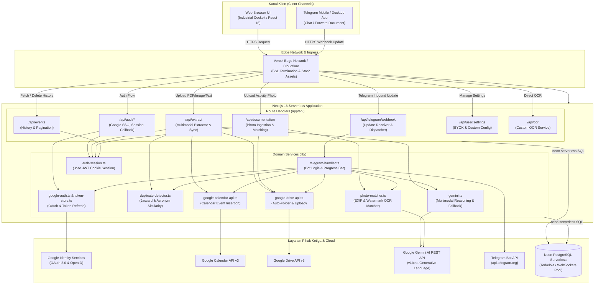
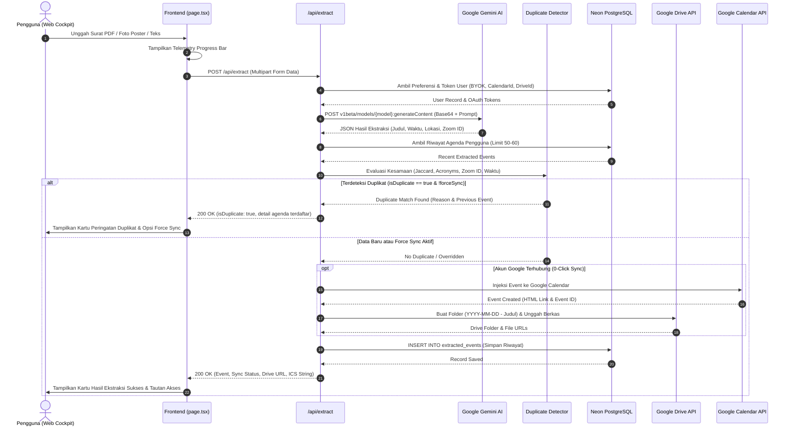
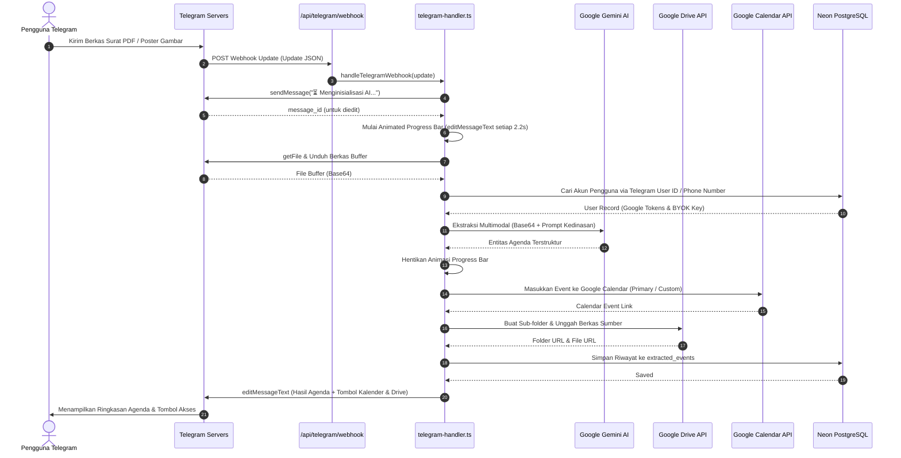
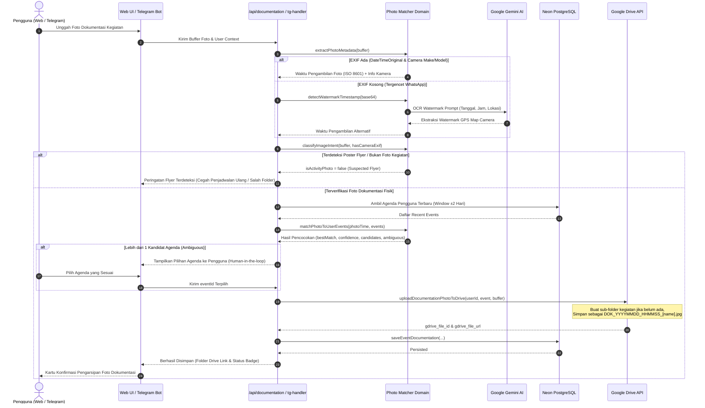

# System Architecture Document
## EasyCal // Serverless OCR & Gemini Calendar Studio

---

## 1. System Overview & Architectural Principles

**EasyCal** dibangun di atas fondasi arsitektur **Serverless Modern**, mengutamakan performa tanpa server fisik (*zero-maintenance infrastructure*), skalabilitas tinggi di tepi jaringan (*edge/serverless compute*), keamanan data terisolasi per pengguna (*multi-tenant BYOK isolation*), serta modularitas kode yang bersih.

### Prinsip Utama Arsitektur:
1. **Stateless Compute**: Seluruh endpoint API dijalankan sebagai Serverless Functions (Next.js App Router di Vercel), tidak menyimpan state di memori proses lokal.
2. **Decoupled Integrations**: Layanan Google APIs (Calendar, Drive, OAuth), AI Engine (Google Gemini), Telegram Bot API, dan Basis Data (Neon PostgreSQL) dihubungkan melalui modul adapter independen di direktori `lib/`.
3. **Multi-Tier Fault Tolerance**: Rantai fallback berlapis untuk pemanggilan AI Gemini (multi-model fallback), kegagalan perizinan folder Google Drive (fallback ke root drive), dan ketersediaan database (fallback ke local cache store).
4. **Sub-second Client Telemetry**: Frontend menyajikan respons visual instan dengan umpan balik telemetri dinamis untuk setiap tahapan pemrosesan AI yang intensif.

---

## 2. High-Level System Architecture Diagram



---

## 3. Technology Stack Breakdown

| Komponen / Lapisan | Teknologi / Pustaka | Versi | Justifikasi Pemilihan |
|---|---|---|---|
| **Framework Web & API** | Next.js (App Router) | `16.3.4` | Serverless route handlers, optimasi bundle, arsitektur hybrid SSR/CSR. |
| **Pustaka Antarmuka** | React & React-DOM | `18.3.1` | Manajemen state reaktif, rendering komponen cepat. |
| **Bahasa Pemrograman** | TypeScript | `5.6.3` | Type safety ketat, antarmuka kontrak data yang jelas. |
| **Sistem Desain & Gaya** | Vanilla CSS (Bespoke Tokens) | CSS3 | Tanpa overhead utilitas eksternal (no-Tailwind), kontrol estetika *Industrial Cockpit* presisi. |
| **Basis Data Cloud** | `@neondatabase/serverless` | `1.1.0` | Driver serverless berbasis HTTP/WebSocket tanpa batas koneksi pooler Postgres tradisional. |
| **Google Cloud SDK** | `googleapis` | `178.0.0` | Klien resmi untuk Google Calendar v3, Google Drive v3, dan OAuth2. |
| **Otentikasi & Sesi** | `jose` | `6.2.10` | Enkripsi dan verifikasi JWT aman, kompatibel dengan Edge runtime. |
| **Manipulasi Tanggal/Waktu**| `luxon` | `3.5.0` | Penanganan zona waktu IANA (`Asia/Jakarta`, UTC+7) dan kalkulasi durasi presisi. |
| **Parser EXIF Citra** | `exifr` | `7.1.3` | Ekstraksi cepat metadata EXIF citra (DateTimeOriginal, Make, Model, GPS) murni di sisi server. |
| **Ikonografi UI** | `lucide-react` | `0.453.0` | Ikon SVG bergaya teknis, ringan, dan tree-shakeable. |
| **Infrastruktur Hosting** | Vercel Serverless | Platform | Deploy otomatis dari Git, auto-scaling global, sertifikat SSL instan. |

---

## 4. Application Layer Breakdown

### 4.1 Presentation Layer (`app/page.tsx`, `app/globals.css`)
* **Single-Page Cockpit View**: Arsitektur dashboard satu halaman terpadu dengan navigasi tab reaktif:
  * Tab `extract`: Workspace ekstraksi terbagi dua kolom (*split-viewport*): zona input (PDF, Gambar, Teks) dan panel telemetri hasil ekstraksi.
  * Tab `settings`: Panel manajemen kredensial pengguna (BYOK API Key, Target Calendar, Drive Root Folder, Telegram Token).
  * Tab `telegram`: Konfigurasi panduan bot, status webhook, dan tombol utilitas pengujian bot.
  * Tab `docs`: Dokumentasi operasional dan integrasi sistem.
* **Telemetry Progress Animation**: Visualisasi dinamis dari tahapan pemindaian dokumen hingga sinkronisasi kalender selesai.
* **Client-Side Storage Fallback**: Menyinkronkan konfigurasi formulir dengan respon sesi server `/api/auth/me`.

### 4.2 API & Routing Layer (`app/api/`)
* **`/api/auth/google`**: Mengenerasi URL otorisasi Google OAuth 2.0 dengan parameter `access_type=offline` dan `prompt=consent` untuk menjamin penerbitan `refresh_token`.
* **`/api/auth/callback`**: Menangkap kode otorisasi dari Google, menukarkannya dengan token, mengambil profil pengguna, memperbarui database, dan membuat JWT cookie sesi.
* **`/api/auth/me`**: Memvalidasi sesi JWT pengguna saat ini dan mengembalikan profil serta pengaturan pengguna.
* **`/api/auth/logout`**: Menghapus cookie sesi HTTP-only.
* **`/api/extract`**: Endpoint sentral penanganan dokumen (multipart/form-data atau JSON). Mengekstrak entitas via Gemini, memeriksa duplikasi, mengunggah arsip ke Google Drive, menginjeksi ke Google Calendar, dan mencatat riwayat.
* **`/api/events`**: Layanan CRUD riwayat agenda pengguna dengan dukungan paginasi (`GET`) dan penghapusan item (`DELETE`).
* **`/api/telegram/webhook`**: Handler webhook yang menerima update dari Telegram API secara asinkron.
* **`/api/telegram/setup`**: Endpoint utilitas untuk memeriksa informasi webhook (*getWebhookInfo*), memasang URL webhook (*setWebhook*), dan menghapus webhook (*deleteWebhook*).
* **`/api/user/settings`**: Memperbarui setelan kredensial per pengguna di database.
* **`/api/ocr`**: Endpoint langsung untuk pemrosesan OCR teks mentah.
* **`/api/documentation`**: Endpoint khusus penanganan foto dokumentasi kegiatan fisik. Menerima multipart/form-data foto, mengekstrak EXIF/watermark waktu, mencocokkan secara otomatis ke agenda pengguna yang relevan, mengunggah ke sub-folder Google Drive kegiatan terkait, dan mencatat relasi di basis data tanpa membuat agenda kalender baru. Mendukung query param `eventId` untuk mengambil riwayat foto kegiatan.

### 4.3 Domain & Business Logic Layer (`lib/`)

#### `photo-matcher.ts` (Mesin Pencocokan Foto & Filter Guardrail)
* **Ekstraktor EXIF Serverless (`extractPhotoMetadata`)**: Menggunakan `exifr` untuk mengekstrak `DateTimeOriginal`, `Make`, `Model`, `latitude`, `longitude`. Menerjemahkan zona waktu lokal ke format ISO 8601 UTC+7.
* **Fallback OCR Watermark Vision (`detectWatermarkTimestamp`)**: Memanggil Gemini Vision jika metadata EXIF hilang (misal akibat kompresi WhatsApp) untuk membaca stempel tanggal, jam, dan lokasi dari aplikasi seperti *GPS Map Camera* atau *Timestamp Camera*.
* **Guardrail Anti-Poster Flyer (`classifyImageIntent`)**: Memeriksa keberadaan EXIF hardware kamera asli. Jika tidak ada EXIF kamera, sistem menjalankan klasifikasi AI cepat guna memastikan gambar bukan poster flyer acara / surat dinas, mencegah salah penempatan berkas.
* **Pencocok Temporal Berbobot (`matchPhotoToUserEvents`)**: Mencocokkan waktu foto terhadap rentang waktu kegiatan pengguna (`start_time - 1 jam` s.d. `end_time + 2 jam`). Memberikan confidence score tinggi jika waktu berada di tengah kegiatan, serta menandai `ambiguous = true` bila ada lebih dari satu agenda yang berdekatan untuk konfirmasi pengguna (human-in-the-loop).

#### `gemini.ts` (Mesin Multimodal & Normalisasi Data)
* **Prompt Engineering Terstruktur**: Prompt sistem berbasis panduan ketat tata kelola dokumen kedinasan Indonesia (Kop surat, nomor dinas, penentuan durasi default 2 jam jika 's.d. selesai', ekstraksi Meeting ID & Passcode Zoom, serta bobot JP).
* **Parser JSON Kebal Anomali (`parseGeminiJson`)**: Menghilangkan code fence markdown (` ```json `), serta membersihkan teks tambahan dengan ekstraksi regex objek terluar.
* **Normalisator Tanggal & Event (`normalizeCalendarEvent`)**: Memvalidasi tanggal ISO 8601, memastikan tanggal selesai tidak mendahului tanggal mulai, dan merapikan string lokasi.
* **Fallback Rantai Model**: Menginisialisasi request berurutan ke model `gemini-3.6-flash` -> `gemini-3.5-flash` -> `gemini-3.1-flash-lite` jika terbentur kuota (HTTP 429) atau keterbatasan kapasitas (HTTP 503).

#### `duplicate-detector.ts` (Sistem Anti-Duplikasi Cerdas)
* **Pembersihan Token & Stop-words**: Memfilter kata penghubung birokrasi yang umum (*dan, di, ke, perihal, sehubungan, bapak, ibu, yth*).
* **Ekspansi Akronim Dinas**: Mengonversi istilah singkatan ke bentuk panjang menggunakan peta kamus administrasi.
* **Multi-Metric Scoring**:
  * $Jaccard(A, B) = \frac{|A \cap B|}{|A \cup B|}$
  * $Containment(A, B) = \frac{|A \cap B|}{\min(|A|, |B|)}$ (menilai kesamaan judul singkatan vs judul lengkap).
  * $Dice(A, B) = \frac{2 \times |Bigrams(A) \cap Bigrams(B)|}{|Bigrams(A)| + |Bigrams(B)|}$ (toleransi kesalahan ketik).
* **Pencocokan Meeting ID Zoom & Meet Code**: Normalisasi ID Zoom numerik 9–11 digit dan format kode Meet (`xxx-yyyy-zzz`).

#### `google-drive-api.ts` (Manajemen Pengarsipan Google Drive)
* **Pembuatan Folder Kronologis**: Membuat folder `YYYY-MM-DD - [Judul Kegiatan]` di bawah folder induk pilihan pengguna.
* **Streaming Upload**: Mengunggah buffer dokumen menggunakan `Readable Stream` untuk efisiensi memori runtime serverless.
* **Konversi Transkrip Teks**: Jika sumber masukan berupa teks obrolan, sistem menghasilkan dokumen teks berformat resmi (`salinan_undangan.txt`) dan mengunggahnya ke Google Drive.
* **Pengunggahan Foto Dokumentasi (`uploadDocumentationPhotoToDrive`)**: Memastikan sub-folder kegiatan tersedia (membuat folder baru bila agenda belum memilikinya), memberi prefix nama berkas `DOK_YYYYMMDD_HHMMSS_[nama].jpg`, dan mengunggah foto langsung ke sub-folder tersebut.
* **Fallback Resilient**: Jika folder induk yang ditentukan tidak dapat diakses (misal telah dihapus di Drive), sistem otomatis membuat folder di Root Drive pengguna tanpa menggagalkan proses kalender.

#### `google-calendar-api.ts` (Integrasi Kalender)
* **Autentikasi Otomatis via Refresh Token**: Memperbarui *access token* yang kedaluwarsa secara otomatis menggunakan event listener `tokens` dari OAuth2Client.
* **Konstruksi Deskripsi Kaya**: Menghasilkan deskripsi agenda terstruktur berisi nomor surat dinas, link meeting, kredensial akses, bobot JP, dan tautan folder Google Drive.

#### `telegram-handler.ts` (Bot Telegram Terintegrasi)
* **Animated Progress Bar Engine**: Mengirim dan memperbarui bilah persentase kemajuan menggunakan `setInterval` asinkron dengan rotasi pesan kontekstual.
* **Verifikasi Kontak (Phone Binding)**: Memproses pesan kontak (`msg.contact`) untuk menyinkronkan identitas Telegram ID dengan nomor HP yang didaftarkan pengguna di dashboard web.
* **Handling Inline Keyboard & Direct Action**: Mengirim kartu hasil agenda dengan tombol langsung ke Google Calendar web dan Google Drive.

---

## 5. Detailed Sequence Diagrams

### 5.1 Web Multimodal Extraction & 0-Click Sync Flow



### 5.2 Telegram Bot Ingestion & Auto-Drive Flow



### 5.3 Smart Photo Documentation Ingestion Flow



---

## 6. Security, Isolation & Multi-Tenancy Architecture

### 6.1 Isolasi Data Pengguna (Data Multi-Tenancy)
* Setiap pengguna diidentifikasi dengan kunci primer unik (`users.id`), yang dibentuk dari format Google ID (`google_123456789...`) atau Telegram ID (`tg_123456789...`).
* Seluruh kueri riwayat agenda (`extracted_events`) difilter secara ketat berdasarkan klausa `user_id = $userId`.
* API Key Google Gemini (BYOK) milik pengguna hanya digunakan untuk mengeksekusi request milik pengguna tersebut dan tidak pernah diekspos ke klien lain.

### 6.2 Siklus Hidup & Penyimpanan Token Google OAuth
* **Refresh Token Persistence**: Token penyegaran (`google_refresh_token`) disimpan di kolom terenkripsi pada tabel `users`.
* **Access Token On-Demand Refresh**: Sistem tidak mengandalkan masa aktif *access token* yang singkat (1 jam). Setiap kali interaksi Google API berlangsung, `oauth2Client` secara otomatis memperbarui *access token* jika sudah kedaluwarsa dan memperbarui nilai expiry di database melalui event callback `tokens`.

### 6.3 Perlindungan Sesi Web
* Menggunakan cookie bertanda tangan `easycal_session` yang dienkripsi menggunakan algoritma `HS256` via pustaka `jose`.
* Cookie dikonfigurasi dengan atribut:
  * `HttpOnly`: Mencegah akses token dari skrip JavaScript sisi klien (mitigasi XSS).
  * `Secure`: Diwajibkan hanya melalui koneksi terenkripsi HTTPS di lingkungan produksi.
  * `SameSite=Lax`: Melindungi sistem dari serangan pemalsuan permintaan lintas situs (*CSRF*).

---

## 7. Deployment & Infrastructure Strategy

### 7.1 Serverless Deployment di Vercel
* Proyek dikonfigurasi menggunakan berkas `vercel.json` dengan deklarasi alokasi waktu eksekusi:
  ```json
  {
    "framework": "nextjs",
    "functions": {
      "app/api/**/*": {
        "maxDuration": 60
      }
    }
  }
  ```
* Nilai `maxDuration: 60` detik menjamin proses ekstraksi berkas PDF berukuran besar (yang membutuhkan waktu round-trip AI 15–30 detik) tidak mengalami *premature function timeout*.

### 7.2 Konektivitas Basis Data Neon PostgreSQL
* Menggunakan pustaka `@neondatabase/serverless` yang berkomunikasi melalui protokol HTTP / WebSocket bawaan Neon.
* Menghindari masalah kehabisan batas koneksi (*connection exhaustion*) yang umum terjadi pada database PostgreSQL tradisional saat ratusan fungsi serverless berjalan bersamaan.
