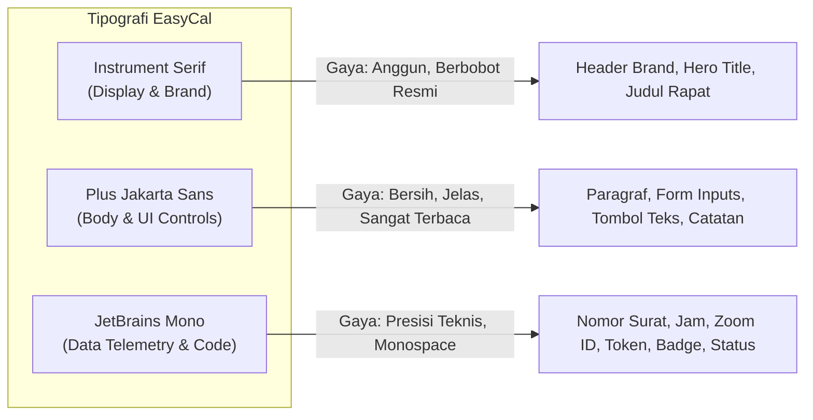

# Design & UI/UX System Document
## EasyCal // Industrial Cockpit & Editorial Precision

---

## 1. Design Philosophy & Aesthetic Identity

**EasyCal** mengusung filosofi desain visual bertajuk **"Industrial Cockpit & Editorial Precision"**. Desain ini sengaja dirancang untuk menghindari klise tampilan aplikasi SaaS AI generik (seperti gradien ungu berkilau, kartu membulat tanpa karakter, atau efek *glassmorphism* buram yang berlebihan).

Sebaliknya, EasyCal menghadirkan antarmuka instrumen kerja yang:
1. **Taktil & Mekanis (Tactile & Purposeful)**: Tombol dan kartu memiliki sensasi kedalaman fisik instrumen laboratorium atau konsol kendali pesawat (*analog precision*). Tombol memiliki efek tekanan fisik nyata (`translateY(1px)` dan *inner shadow* saat ditekan).
2. **Kepadatan Informasi Terstruktur (High Data-Density)**: Informasi penting (nomor surat, ruang rapat, kredensial Zoom, JP) disajikan secara jelas tanpa banyak ruang kosong yang sia-sia, sangat cocok untuk efisiensi alur kerja birokrasi dan perkantoran.
3. **Telemetri & Status Hidup (Living Telemetry)**: Dilengkapi lampu indikator LED berkedip (*pulsing status LEDs*), bilah kemajuan teknis (*telemetry progress bars*), dan tipografi monospasi untuk angka dan metadata teknis.
4. **Sentuhan Tipografi Editorial**: Judul utama menggunakan huruf bertipe serif anggun (*Instrument Serif*) dipadukan dengan tipografi tubuh yang sangat terbaca (*Plus Jakarta Sans*) dan angka berkarakter teknik (*JetBrains Mono*).

---

## 2. Design Tokens & Color Palette

Seluruh palet warna dikelola melalui variabel CSS (*CSS Custom Properties*) di berkas `app/globals.css`:

### 2.1 Canvas & Chassis Colors (Latar Belakang & Rangka)
| Token CSS | Kode Heksadesimal / Nilai | Peran & Penggunaan |
|---|---|---|
| `--bg-void` | `#090B0D` | Latar belakang kanvas dasar terdalam (*deep dark void*). |
| `--bg-surface` | `#111418` | Latar belakang kartu sasis (*chassis cards*) dan panel utama. |
| `--bg-surface-elevated` | `#181C22` | Panel mengambang, bilah header kartu, dan tombol kendali sekunder. |
| `--bg-inset` | `#0C0E11` | Area masukan teks (*input wells*) dan wadah kode berkedalaman. |
| `--bg-glass` | `rgba(17, 20, 24, 0.85)` | Lapisan semi-transparan dengan *backdrop-blur* untuk navigasi menempel. |

### 2.2 Telemetry Inks (Warna Teks & Tipografi)
| Token CSS | Kode Heksadesimal | Peran & Kontras |
|---|---|---|
| `--text-main` | `#F0F4F8` | Teks utama dengan tingkat keterbacaan tinggi (kontras > 14:1 terhadap void). |
| `--text-dim` | `#8B98A9` | Label sekunder, instruksi pendukung, dan teks deskripsi. |
| `--text-faint` | `#485464` | Garis panduan, placeholder, dan teks metadata terselubung. |

### 2.3 Indicator Spot Accents (Aksen Indikator Status)
| Token CSS | Kode Heksadesimal | Peran & Makna Visual |
|---|---|---|
| `--signal-amber` | `#FF9E0B` | **Aksen Identitas Utama**: Tombol aksi primer, fokus aktif, sorotan teks pilihan (*selection*). |
| `--signal-amber-glow` | `rgba(255, 158, 11, 0.15)` | Pendaran halus di sekitar elemen interaktif aktif. |
| `--signal-green` | `#00FF66` | **Status Sukses / Terhubung**: LED koneksi Google Calendar aktif, notifikasi sinkronisasi berhasil. |
| `--signal-green-glow` | `rgba(0, 255, 102, 0.15)` | Pendaran lampu LED status online. |
| `--signal-blue` | `#00D4FF` | **Status AI / Telemetri**: Indikator pemrosesan Gemini AI, tautan eksternal, mode hybrid. |
| `--signal-red` | `#FF334B` | **Status Kritis / Peringatan**: Kesalahan otentikasi, peringatan duplikasi agenda, tombol hapus riwayat. |

### 2.4 Structural Borders (Batas & Garis Panel)
| Token CSS | Nilai Border | Penggunaan |
|---|---|---|
| `--border-chassis` | `1px solid #202732` | Garis pemisah panel kabin dan kartu sasis dasar. |
| `--border-bright` | `1px solid #313B4A` | Garis batas tombol interaktif dan kartu yang sedang aktif. |
| `--border-subtle` | `1px solid rgba(255, 255, 255, 0.07)` | Pembatas mikro antar kolom data. |

---

## 3. Typography Hierarchy

EasyCal memadukan tiga keluarga tipografi (*font stacks*) secara harmonis:

### Panduan Skala Tipografi:
* **Display / Brand Title**: Font size `1.75rem` – `2.25rem`, *weight* 400, *letter-spacing* `-0.01em` (`Instrument Serif`).
* **Section Heading / Cockpit Header**: Font size `0.75rem` – `0.85rem`, *weight* 600, *text-transform* `uppercase`, *letter-spacing* `0.08em` (`JetBrains Mono`).
* **Body Text**: Font size `0.9375rem`, *line-height* 1.6 (`Plus Jakarta Sans`).
* **Telemetry Data & Tags**: Font size `0.75rem` – `0.8125rem`, *weight* 500 (`JetBrains Mono`).

---

## 4. Component Architecture & UI Elements

### 4.1 Masthead & Live Indicator LEDs
Header navigasi teratas menyatukan identitas brand dengan status operasional langsung:
* **Pulsing LED Indicator**: Lingkaran berukuran `8x8px` dengan animasi pendaran `pulseLed` 2.2 detik:
  * Hijau: Database Neon terhubung dan sesi Google Calendar aktif.
  * Kuning: Memproses data / Memerlukan konfigurasi API Key.
  * Merah: Koneksi terputus atau sesi habis.
* **User Profile Chip**: Blok kompak di sudut kanan atas yang merangkum foto profil akun Google, nama, dan alamat email aktif.

### 4.2 Tactile Buttons (`.btn-tactile`)
Tombol dirancang dengan respon mekanis taktil:
* **Default State**: Background `--bg-surface-elevated`, border `--border-bright`, font monospasi berbobot `600`.
* **Hover State**: Mengangkat 1px ke atas (`translateY(-1px)`) dengan sedikit perubahan saturasi border.
* **Active (Click) State**: Menekan ke bawah 1px (`translateY(1px)`) dengan bayangan dalam (`inset 0 2px 4px rgba(0, 0, 0, 0.4)`), mensimulasikan tombol instrumen fisik yang tertekan.
* **Varian**:
  * `.btn-primary`: Warna latar `--signal-amber` dengan teks hitam tegas untuk aksi konversi utama.
  * `.btn-success`: Warna latar `--signal-green` untuk aksi buka Google Calendar atau simpan pengaturan.
  * `.btn-danger`: Warna latar merah transparan halus untuk aksi hapus riwayat agenda.

### 4.3 Split-Viewport Cockpit Layout
Ruang kerja pengguna terbagi menjadi dua kolom asimetris seimbang:
* **Kolom Kiri (Input Station - 1fr)**:
  * Tab pemilih sumber masukan: PDF, Gambar Poster, atau Teks Obrolan.
  * Zona Drag & Drop interaktif dengan garis putus-putus (*dashed border*) yang menyala kuning saat berkas diseret di atasnya.
  * Tombol Preset Contoh Undangan (Surat Resmi Kemnaker & Flyer Webinar) untuk pengujian instan.
* **Kolom Kanan (Telemetry Results - 1.15fr)**:
  * Panel hasil ekstraksi terstruktur.
  * Blok kredensial rapat (Zoom ID & Passcode) dengan tombol salin instan (*1-tap copy*).
  * Kartu indikator duplikat jika agenda serupa pernah terdaftar.
  * Tombol aksi cepat: *Buka di Google Calendar*, *Unduh File .ICS*, dan *Buka Folder Google Drive*.

### 4.4 Telemetry Progress Bar
Saat proses AI berlangsung (antara 8–20 detik), sistem menyajikan bilah telemetri animasi:
* Jalur track gelap berkedalaman (`--bg-inset`) dengan pengisi bilah berwarna aksen menyala (*amber-to-blue glow*).
* Teks tahapan yang berganti secara dinamis:
  1. `Mengunduh & memvalidasi berkas dokumen...`
  2. `Mendeteksi tata letak naskah & nomor dinas...`
  3. `Menganalisis isi surat dengan Google Gemini AI...`
  4. `Mengekstrak tanggal, jam rapat (WIB), dan durasi...`
  5. `Mendeteksi Meeting ID Zoom, Passcode, & Bobot JP...`
  6. `Menyiapkan sinkronisasi 0-Click Google Calendar...`

### 4.5 Duplicate Alert Card
Komponen penahan kesalahan (*error prevention banner*) jika dokumen yang diproses terindikasi sudah pernah diinput sebelumnya:
* Border bertema peringatan merah/oranye dengan ikon peringatan (`AlertTriangle`).
* Menyajikan ringkasan agenda sebelumnya yang cocok: judul terdaftar, jam, serta tanggal riwayat pemrosesan.
* Menyediakan tombol alternatif **"Tetap Simpan ke Kalender (Force Sync)"** jika pengguna mengonfirmasi bahwa acara tersebut memang sengaja dijadwalkan ulang.

### 4.6 Photo Documentation Cockpit UI (`.photo-preview-card` & Candidate Picker)
Ruang kerja khusus untuk pengunggahan dan auto-filing foto dokumentasi fisik kegiatan:
* **Tab Switcher `[📸 Foto Dokumentasi]`**: Menampilkan badge kamera kuning yang mengalihkan zona input ke mode pemindaian foto kegiatan.
* **Photo Preview Card (`.photo-preview-card`)**:
  * Thumbnail citra terunggah dengan rasio aspek terjaga dan border sasis berkedalaman.
  * Tag telemetri metadata (`.photo-meta-tag`): Indikator waktu pengambilan (`DateTimeOriginal`), merk & tipe kamera (`Make`/`Model`), status deteksi GPS, atau label *Watermark OCR*.
* **Candidate Event Picker (`.candidate-event-item`)**:
  * Ditampilkan secara otomatis jika terdapat lebih dari satu kegiatan dalam jendela waktu yang berdekatan.
  * Menampilkan judul kegiatan, jam mulai, selisih waktu dari foto (misal: *+15 menit dari awal acara*), dan badge tingkat kecocokan (*Tinggi / Sedang*).
* **Flyer Guardrail Warning (`.photo-match-alert`)**:
  * Peringatan bersinyal merah jika citra terdeteksi sebagai poster promosi atau selebaran, dilengkapi tombol pintasan untuk memindahkan berkas ke tab **Poster (Gambar)** guna diekstrak kalendernya.
* **Event Card Quick Action (`+ Foto Dok`)**:
  * Tombol pintas taktil kuning pada setiap kartu agenda di kolom riwayat kanan, memungkinkan pengguna langsung mengunggah foto ke folder Google Drive kegiatan tersebut dalam 1 klik.

---

## 5. Responsive Design & Breakpoints

| Breakpoint | Penyesuaian Tata Letak |
|---|---|
| **Desktop (> 1024px)** | Layout grid 2 kolom penuh (`split-viewport: 1fr 1.15fr`), padding kontainer luas. |
| **Tablet (768px – 1024px)** | Grid berganti menjadi kolom tunggal bertumpuk (*stacked vertical*). Kolom input di atas, hasil ekstraksi di bawah. |
| **Mobile (< 768px)** | Header masthead membungkus item (*flex-wrap*), bilah tab cockpit dapat digulir horizontal (*overflow-x: auto*), padding disesuaikan ke `1rem`. |

---

## 6. Micro-Interactions & Animation Constants

* **Kurva Transisi Snappy**: `--ease-snappy: cubic-bezier(0.16, 1, 0.3, 1)` memberikan akselerasi awal cepat dan perlambatan halus (*ultra-crisp feel*).
* **Durasi Cepat**: `--duration-fast: 150ms` untuk respon hover dan klik instan tanpa lag visual.
* **Tekstur Noise Halus**: Latar belakang seluruh halaman dilapisi SVG fractal noise ber-opacity `0.025` yang memberikan tekstur kertas taktil mikro pada monitor modern beresolusi tinggi.
