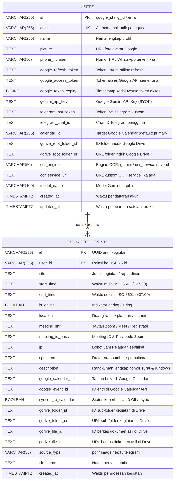

# Database Schema & Data Model Document
## EasyCal // Serverless Data Architecture & Contracts

---

## 1. Database Overview & Engine

EasyCal menggunakan basis data **Neon PostgreSQL Serverless** yang terhubung melalui pustaka `@neondatabase/serverless`. Arsitektur ini dirancang untuk:
* **Serverless HTTP/WebSocket Connection Pool**: Menghilangkan batasan koneksi persisten Postgres konvensional pada runtime serverless (Vercel).
* **Auto-Schema Migration (`initDatabase`)**: Menjalankan migrasi DDL otomatis saat aplikasi pertama kali dieksekusi tanpa perlu perkakas CLI migrasi tambahan.
* **Dual-Layer Resilience**: Apabila variabel environment database (`DATABASE_URL` atau `POSTGRES_URL`) tidak terkonfigurasi, sistem secara otomatis beralih ke penyimpanan lokal (*fallback JSON storage*) pada berkas `.user_tokens.json` dan `.user_events.json`.

---

## 2. Entity-Relationship Diagram (ERD)



---

## 3. SQL Table Specifications & Data DDL

### 3.1 Tabel `users`
Tabel penyimpan profil pengguna, kredensial OAuth terenkripsi, dan setelan preferensi BYOK.

```sql
CREATE TABLE IF NOT EXISTS users (
  id VARCHAR(255) PRIMARY KEY,
  email VARCHAR(255) UNIQUE NOT NULL,
  name VARCHAR(255),
  picture TEXT,
  phone_number VARCHAR(50),
  google_refresh_token TEXT,
  google_access_token TEXT,
  google_token_expiry BIGINT,
  gemini_api_key TEXT,
  telegram_bot_token TEXT,
  telegram_chat_id TEXT,
  calendar_id VARCHAR(255) DEFAULT 'primary',
  gdrive_root_folder_id TEXT,
  gdrive_root_folder_url TEXT,
  ocr_engine VARCHAR(50) DEFAULT 'gemini',
  ocr_service_url TEXT,
  model_name VARCHAR(100) DEFAULT 'gemini-3.6-flash',
  created_at TIMESTAMPTZ DEFAULT NOW(),
  updated_at TIMESTAMPTZ DEFAULT NOW()
);

-- Indeks Tambahan untuk Pencarian Cepat via Nomor HP (Telegram Contact Binding)
CREATE INDEX IF NOT EXISTS idx_users_phone ON users(phone_number);
```

### 3.2 Tabel `extracted_events`
Tabel penyimpan seluruh riwayat agenda yang berhasil diekstrak dan disinkronisasi.

```sql
CREATE TABLE IF NOT EXISTS extracted_events (
  id VARCHAR(255) PRIMARY KEY,
  user_id VARCHAR(255) NOT NULL,
  title TEXT NOT NULL,
  start_time TEXT NOT NULL,
  end_time TEXT NOT NULL,
  is_online BOOLEAN DEFAULT false,
  location TEXT,
  meeting_link TEXT,
  meeting_id_pass TEXT,
  jp TEXT,
  speakers TEXT,
  description TEXT,
  google_calendar_url TEXT,
  google_event_id TEXT,
  synced_to_calendar BOOLEAN DEFAULT false,
  gdrive_folder_id TEXT,
  gdrive_folder_url TEXT,
  gdrive_file_id TEXT,
  gdrive_file_url TEXT,
  source_type VARCHAR(50) DEFAULT 'web',
  file_name TEXT,
  created_at TIMESTAMPTZ DEFAULT NOW()
);

-- Indeks Gabungan untuk Paginasi Riwayat per Pengguna
CREATE INDEX IF NOT EXISTS idx_extracted_events_user ON extracted_events(user_id, created_at DESC);
```

---

## 4. TypeScript Contracts & Interfaces

Seluruh pertukaran data di aplikasi dikendalikan oleh tipe data ketat pada `lib/types.ts` dan `lib/db.ts`:

### 4.1 `CalendarEvent`
Kontrak hasil ekstraksi standar yang siap disinkronisasi ke Google Calendar:
```typescript
export interface CalendarEvent {
  title: string;
  start_time: string; // Format ISO 8601 (e.g. 2026-09-10T09:00:00+07:00)
  end_time: string;   // Format ISO 8601
  is_online: boolean;
  location: string;
  meeting_link: string;
  meeting_id_pass: string;
  jp: string;
  speakers: string;
  description: string;
  google_calendar_url?: string;
}
```

### 4.2 `ExtractionRequest` & `ExtractionResponse`
Kontrak pengiriman berkas dan tanggapan mesin AI Gemini:
```typescript
export type ExtractionEngine = 'gemini' | 'ocr_service' | 'hybrid';
export type SourceMediaType = 'pdf' | 'image' | 'text';

export interface ExtractionRequest {
  apiKey?: string;
  model?: string;
  engine?: ExtractionEngine;
  sourceType: SourceMediaType;
  text?: string;
  base64Data?: string;
  mimeType?: string;
  fileName?: string;
}

export interface ExtractionResponse {
  success: boolean;
  event?: CalendarEvent;
  rawOcrText?: string;
  modelUsed?: string;
  engineUsed?: ExtractionEngine;
  error?: string;
  debugInfo?: string;
}
```

### 4.3 `DuplicateDetectionResult`
Kontrak data evaluasi sistem anti-duplikasi:
```typescript
export interface DuplicateDetectionResult {
  isDuplicate: boolean;
  confidence: number;
  reason: string;
  matchedEvent?: ExtractedEventRecord;
  matchedDetails?: {
    dateMatch: boolean;
    timeDiffMinutes: number;
    titleScore: number;
    meetingIdMatch: boolean;
    locationMatch: boolean;
  };
}
```

---

## 5. Storage Fallback Mechanism (Offline / Local Dev)

Bila sistem dijalankan tanpa koneksi `DATABASE_URL`:
1. **Penyimpanan Profil (`.user_tokens.json`)**:
   Data pengguna disimpan dalam struktur berkas JSON berformat:
   ```json
   {
     "google_123456789": {
       "id": "google_123456789",
       "email": "alfari@example.com",
       "name": "Alfari Ghilmana",
       "google_refresh_token": "1//04...",
       "gemini_api_key": "AIzaSy...",
       "calendar_id": "primary"
     }
   }
   ```
2. **Penyimpanan Riwayat (`.user_events.json`)**:
   Berupa larik objek (*array of records*) `ExtractedEventRecord[]` yang disaring secara in-memory saat kueri paginasi diminta.

---

## 6. Query Access Patterns & Data Resolutions

| Operasi Data | Jalur Resolusi Kueri | Optimasi Performa |
|---|---|---|
| **Pencarian Pengguna Multi-Identitas (`getUserById`)** | Mencari berdasarkan `id`, `cleanId`, `email`, atau `telegram_chat_id`. | Kueri tunggal dengan operator `OR` dan `LIMIT 1`. |
| **Penyambungan Nomor HP (`linkTelegramUserByPhone`)** | Mencocokkan nomor telepon ternormalisasi (`62812...`) pada kolom `phone_number`. | Memanfaatkan indeks `idx_users_phone`. |
| **Pemeriksaan Duplikasi (`getRecentExtractedEventsForUser`)** | Mengambil 50–60 entri agenda terbaru milik kandidat ID pengguna. | Memanfaatkan indeks `idx_extracted_events_user` dengan klausa `ORDER BY created_at DESC LIMIT 60`. |
| **Paginasi Riwayat Dashboard (`getUserExtractedEvents`)** | Menghitung total entri (`COUNT(*)`) dan mengambil potongan halaman dengan `LIMIT` dan `OFFSET`. | Beroperasi pada indeks terklaster `user_id, created_at DESC`. |
